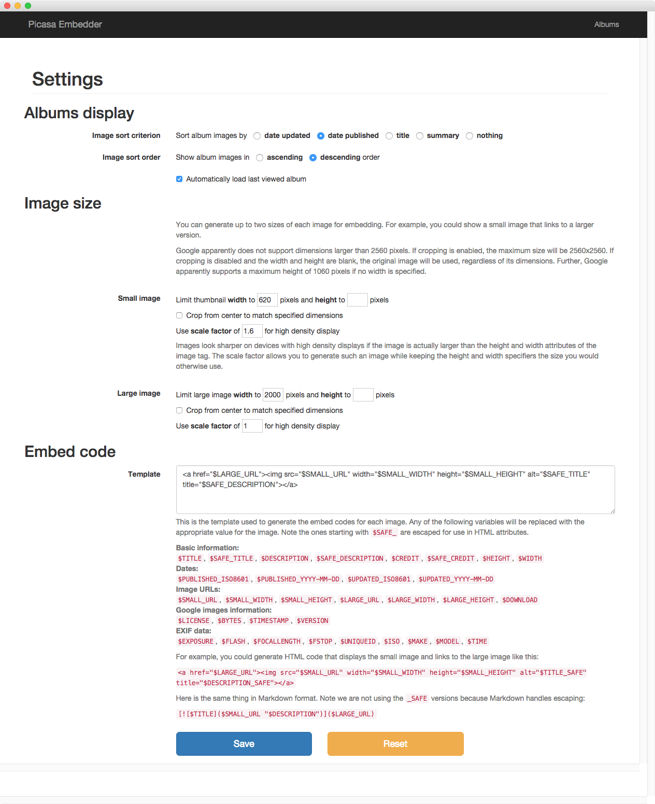
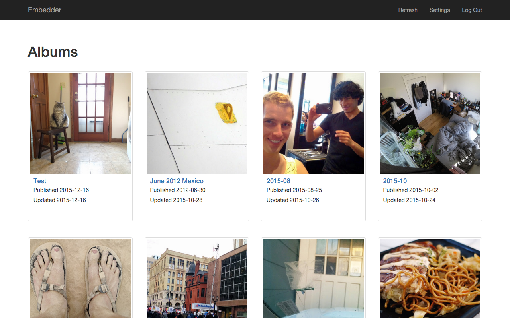
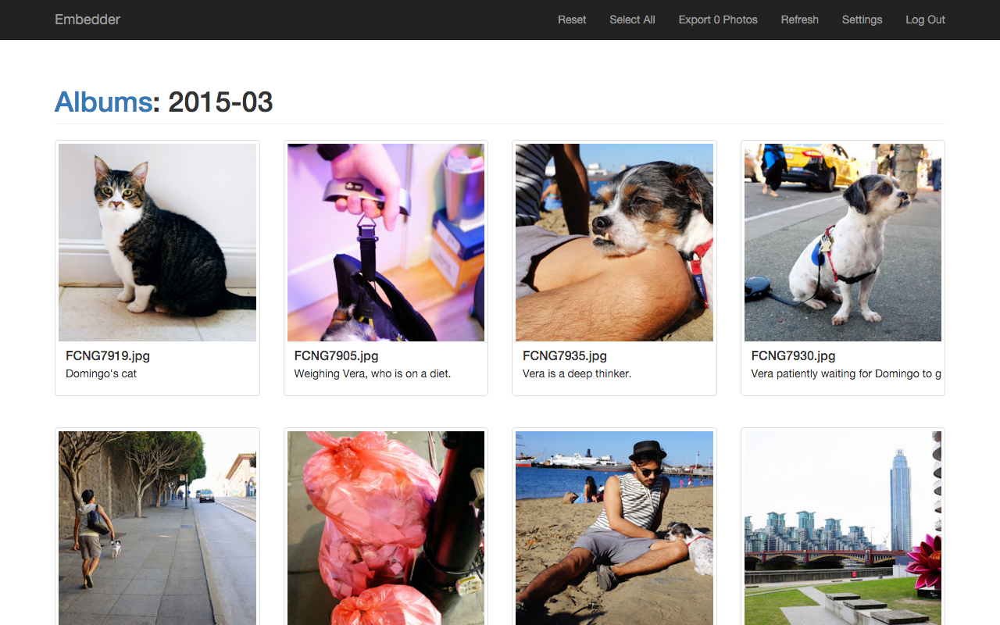
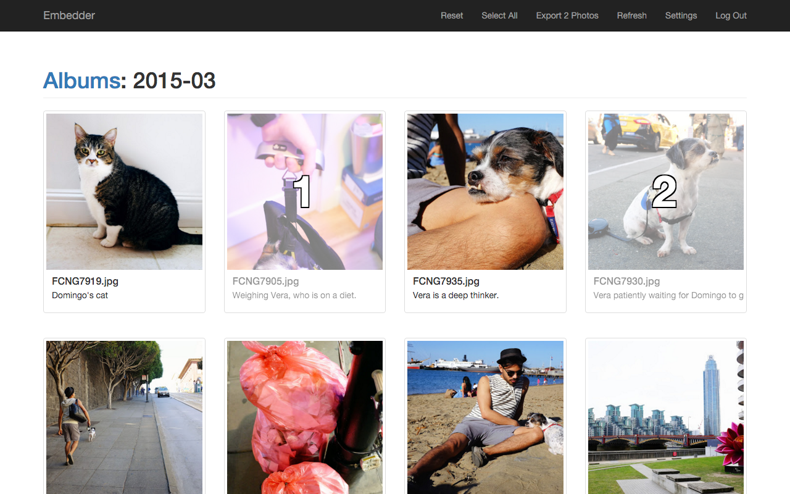
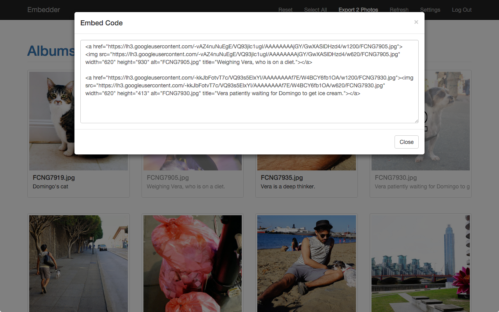

# Embedder
Chrome packaged app for generating embed codes for Google Photos and Picasa Web Albums content. Available in the [Chrome Web Store](https://chrome.google.com/webstore/detail/embedder/pjeebgjjgfhpdilimjnjjjdabkmfpjbc).

## History

This app was a long time coming. Since it veers into personal territory, you can [read the background on my blog](https://votecharlie.com/blog/2015/12/embedder-released.html).

## Code structure

This is a [Chrome packaged app](https://developer.chrome.com/extensions/apps) built with [AngularJS](http://angularjs.org/).

[`manifest.json`](manifest.json) has what Chrome needs to run the app, including icons, descriptions and permissions settings. (It needs the `client_id` set correctly for publication. The version in this repo includes both the ive and my testing IDs.)

[`background.js`](js/background.js) actually launches the app window, setting the size and target HTML file.

[`index.html`](index.html) is the app's main page, which includes all the scripts. Angular substitutes the contents of the HTML files in [`partials`](partials) for the element marked with `ng-view`.

The main app setup is in [`app.js`](js/app.js), and logic specific to the views is in [`controllers.js`](js/controllers.js). [`util.js`](js/util.js) stores some functions used around the app, and [`picasa.js`](js/picasa.js) handles interaction with the data API. The other scripts are libraries required for Angular and the functionality I am using.

## Demo

1. Open the app and configure the settings you want to use for generating the embed codes.
   
   

1. Click the albums link and select the album from which to export photos.
   
   

1. Click the photos you want to export, in the order you want to export. You can also make use of the "select all" and "reset" links at the top.
   
      
   

1. Once finished selecting, click the export link at the top to generate the embed HTML from the template you set up on the settings page.
   
   
   
1. Copy and paste this HTML into your website, blog, forum post or anywhere else HTML is accepted.

## History

* **1.0**, released 2015-12-23
